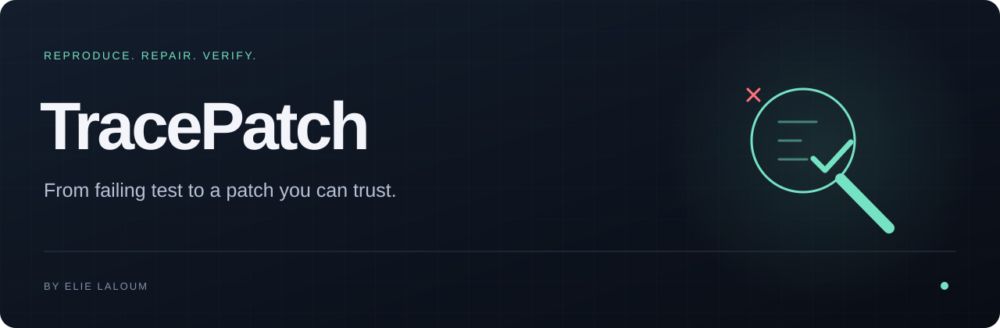

<p align="right"><a href="README.md">English</a></p>


<!-- project badges -->
<p>
<a href="README.md"></a>
<a href="https://github.com/elie-laloum/tracepatch/actions/workflows/ci.yml"></a>
<a href="LICENSE"></a>
<a href="README.md#see-it-in-action"></a>
</p>
<p>
<a href="README.md#quick-start"></a>
<a href="README.md#quick-start"></a>
<a href="README.md#quick-start"></a>
</p>
<!-- /project badges -->

# TracePatch

**Donnez à un agent un échec reproduit et un périmètre de code précis. Récupérez un patch accompagné des vérifications réellement exécutées.**

## Voir la démo

<a href="assets/demo.mp4"></a>

<sub>Démo réellement exécutée, rejouée avec des annotations et un rythme adapté à la lecture. Adaptateur déterministe ; Git et les vérifications s’exécutent réellement.</sub>

[Vidéo MP4](assets/demo.mp4) · [Reproduire la démo](docs/demo.md)

## Essayer la version 0.1

```sh
git clone https://github.com/elie-laloum/tracepatch.git
cd tracepatch
npm test
npm run demo
```

La démonstration corrige le calcul des quantités dans un panier. Les tests existants passent ensuite et le dépôt de départ reste intact.

## Utilisation et périmètre

Configurez un dépôt Git propre, les fichiers source autorisés, les commandes de test et un adaptateur. La démonstration utilise un adaptateur déterministe sans clé API. L’adaptateur Anthropic nécessite votre clé et un identifiant de modèle. Son contrat est testé, mais les performances de correction par modèle réel ne sont pas évaluées. Les commandes s’exécutent avec vos permissions locales.

[Configuration complète et contrat de l’API](README.md#use-it-on-your-project) · [Limites détaillées](README.md#boundaries) · [Contribuer](CONTRIBUTING.md)

La documentation technique de référence est en anglais. Cette traduction présente le démarrage et le périmètre de la version actuelle.

[GitLab origin](https://gitlab.elielaloum.com/elielaloum/tracepatch) · [GitHub mirror](https://github.com/elie-laloum/tracepatch)

Le dépôt GitLab privé contient la source de référence ; GitHub en est le miroir public.
